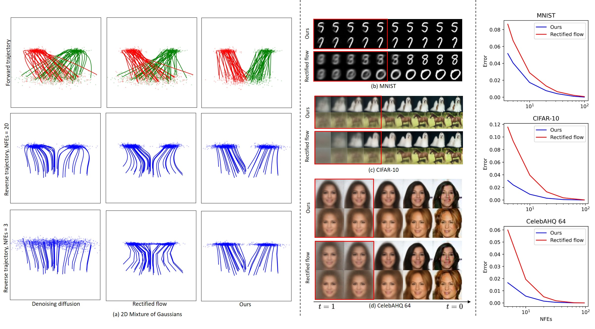

# Residual-ODE

This is the codebase for Residual-ODE.




## Usage
`train_reverse_2d_joint.py`: Training code for two mode Gaussian example.

`train_reverse_img_ddp`: Original training code for image data.

`train_residual_reverse_img_ddp`: Our training code for image data.

`fid.py`: Calculate FID score.

### Train CIFAR-10
```python
python train_residual_reverse_img_ddp.py --N 16 --residual-number 3 --gpu 2,3,4,5 --dir ./runs/cifar10-residual-beta20/ --weight_prior 20 --learning_rate 2e-4 --dataset cifar10 --warmup_steps 5000 --optimizer adam --batchsize 64 --iterations 500000 --config_en configs/cifar10_en.json --config_de configs/cifar10_de.json --resume ./runs/cifar10-residual-beta20/training_state_latest.pth

python train_reverse_img_ddp.py --N 16 --gpu 2,3,4,5 --dir ./runs/cifar10-beta20/ --weight_prior 20 --learning_rate 2e-4 --dataset cifar10 --warmup_steps 5000 --optimizer adam --batchsize 64 --iterations 500000 --config_en configs/cifar10_en.json --config_de configs/cifar10_de.json --resume ./runs/cifar10-residual-beta20/training_state_latest.pth
 ```

### Generate CIFAR-10
```python
python generate_residual.py --gpu 0 --dir ./runs/cifar10-residual-beta20/test/ --N 2 --res 32 --input_nc 3 --num_samples 128 --ckpt ./runs/cifar10-residual-beta20/flow_model_300000_ema.pth --encoder ./runs/cifar10-residual-beta20/forward_model_300000_ema.pth --config_en configs/cifar10_en.json --config_de configs/cifar10_de.json --dataset cifar10

python generate.py --gpu 3 --dir ./runs/cifar10-beta20/test_16/ --N 16 --res 32 --input_nc 3 --num_samples 50000 --ckpt ./runs/cifar10-beta20/flow_model_500000_ema.pth --config_en configs/cifar10_en.json --config_de configs/cifar10_de.json --dataset cifar10
 ```

```python
python eval_residual.py --gpu 0 --dir ./runs/cifar10-residual-beta20/test/ --N 16 --res 32 --input_nc 3 --num_samples 512 --ckpt ./runs/cifar10-residual-beta20/flow_model_300000_ema.pth --encoder ./runs/cifar10-residual-beta20/forward_model_300000_ema.pth --config_en configs/cifar10_en.json --config_de configs/cifar10_de.json --dataset cifar10 --eval_mode 111
```

### Train MNIST
```python
 python train_reverse_img_ddp.py --gpu 0,1 --dir ./runs/mnist-beta20/ --weight_prior 20 --learning_rate 3e-4 --dataset mnist --warmup_steps 8000 --optimizer adam --batchsize 256 --iterations 60000 --config_en configs/mnist_en.json --config_de configs/mnist_de.json
 ```


### MNIST distillation
```python
 python distill.py --gpu 0 --config_de ./configs/mnist_de.json --dir test --im_dir C:\ML\learned-flow\mnist-learned-beta5\60000-N128-num100K\samples --im_dir_test C:\ML\learned-flow\mnist-learned-beta5\60000-N128-num100K\samples_test --z_dir C:\ML\learned-flow\mnist-learned-beta5\60000-N128-num100K\zs --z_dir_test C:\ML\learned-flow\mnist-learned-beta5\60000-N128-num100K\zs_test --batchsize 256 --ckpt D:\ML\learned-flows\runs\reverse\mnist-learned-beta5\flow_model_60000_ema.pth 
 ```

### Generate MNIST
```python
python generate.py --gpu 0 --dir test --N 100 --res 28 --input_nc 1 --num_samples 10 --ckpt D:\ML\learned-flows\runs\reverse\mnist-learned-beta20\flow_model_60000_ema.pth --config_de configs\mnist_de.json 
 ```


### Generate MNIST from posterior
```python
 python generate.py --gpu 0 --dir test --N 100 --res 28 --input_nc 1 --num_samples 10 --ckpt D:\ML\learned-flows\runs\reverse\mnist-learned-beta20\flow_model_60000_ema.pth --encoder D:\ML\learned-flows\runs\reverse\mnist-learned-beta20\forward_model_60000_ema.pth --config_en configs\mnist_en.json --config_de configs\mnist_de.json --dataset mnist 
 ```


### Calcuate FID on cifar10
```python
python fid.py calc --images=runs/ --ref=https://nvlabs-fi-cdn.nvidia.com/edm/fid-refs/cifar10-32x32.npz
```

CIFAR-10 training roughly takes 9 days on 2x1080Ti.


## Environment
Tested environment: PyTorch 1.12.0 / 1.11.0, Python 3.8.5, Windows 10, CUDA 10.1

## Acknowledgement
We borrow some codes from the implementations of
- https://arxiv.org/abs/2206.00364
- https://arxiv.org/abs/2209.03003
- https://arxiv.org/abs/2105.05233
- https://arxiv.org/abs/2301.12003
. We thank the authors for their great work.

