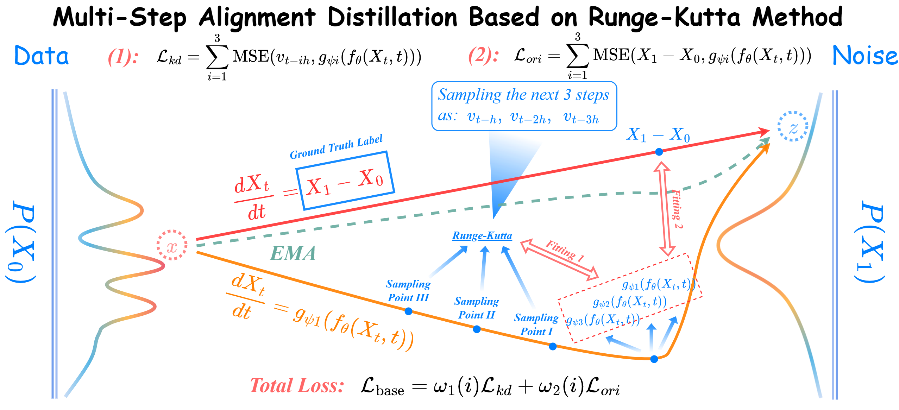

# Paper
Catch-Up Distillation: You Only Need to Train Once for Accelerating Sampling [paper](https://arxiv.org/abs/2305.10769).

Only code for experiments on CIFAR-10 and MNIST are presented here. ImagNet-64 and other experiments are still being added and will be implemented based on the official Consistency Model respository.

Our Runge-Kutta-based multi-step alignment distillation method can be formulated as



## Usage
`train_consistency_reverse_img_ddp.py`: Training Consistency Distillation on Rectified flow.

`train_cud_reverse_img_ddp.py`: Training Catch-Up Distillation on Rectified flow.

`train_progdist_reverse_img_ddp.py`: Training Progressive Distillation on Rectified flow.

`train_distill_update.py`: Training Final Multi-Step Distillation on Rectified flow.

`fid.py`: Calculate FID score.

`is.py`: Calculate IS score.

### Train CIFAR-10
```python
python train_cud_reverse_img_ddp.py  --N 16 --gpu 0,1,2,3       --dir ./runs/cifar10-onlineslim-predstep-1-uniform-shakedrop0.75-beta20/ \
    --weight_prior 20 --learning_rate 2e-4 --dataset cifar10 --warmup_steps 5000  --optimizer adam --batchsize 128 --iterations 500000  \
    --config_en configs/cifar10_en.json --config_de configs/cifar10_de.json --loss_type mse --pred_step 1 --adapt_cu uniform --shakedrop # Runge-Kutta 12

python train_cud_reverse_img_ddp.py  --N 16 --gpu 0,1,2,3       --dir ./runs/cifar10-onlineslim-predstep-2-uniform-shakedrop0.75-beta20/ \
    --weight_prior 20 --learning_rate 2e-4 --dataset cifar10 --warmup_steps 5000  --optimizer adam --batchsize 128 --iterations 500000  \
    --config_en configs/cifar10_en.json --config_de configs/cifar10_de.json --loss_type mse --pred_step 2 --adapt_cu uniform --shakedrop # Runge-Kutta 23

python train_cud_reverse_img_ddp.py  --N 16 --gpu 0,1,2,3       --dir ./runs/cifar10-onlineslim-predstep-3-uniform-shakedrop0.75-beta20/ \
    --weight_prior 20 --learning_rate 2e-4 --dataset cifar10 --warmup_steps 5000  --optimizer adam --batchsize 128 --iterations 500000  \
    --config_en configs/cifar10_en.json --config_de configs/cifar10_de.json --loss_type mse --pred_step 3 --adapt_cu uniform --shakedrop # Runge-Kutta 34
 ```

### Generate CIFAR-10 (Euler's mthod with 16 steps)
```python
python generate.py --gpu 0 --dir ./runs/cifar10-onlineslim-predstep-1-uniform-shakedrop0.75-beta20/test_16 --N 16 --res 32 --input_nc 3 --num_samples 50000 --ckpt ./runs/cifar10-onlineslim-predstep-1-uniform-shakedrop0.75-beta20/flow_model_500000_ema.pth --config_en configs/cifar10_en.json --config_de configs/cifar10_de.json --dataset cifar10 --solver euler --shakedrop --phi 0.75 # Runge-Kutta 12

python generate.py --gpu 0 --dir ./runs/cifar10-onlineslim-predstep-2-uniform-shakedrop0.75-beta20/test_16 --N 16 --res 32 --input_nc 3 --num_samples 50000 --ckpt ./runs/cifar10-onlineslim-predstep-2-uniform-shakedrop0.75-beta20/flow_model_500000_ema.pth --config_en configs/cifar10_en.json --config_de configs/cifar10_de.json --dataset cifar10 --solver euler --shakedrop --phi 0.75 --generator 2 --generator_path ./runs/cifar10-onlineslim-predstep-2-uniform-shakedrop0.75-beta20/generator_list_500000_ema.pth # Runge-Kutta 23

python generate.py --gpu 0 --dir ./runs/cifar10-onlineslim-predstep-3-uniform-shakedrop0.75-beta20/test_16 --N 16 --res 32 --input_nc 3 --num_samples 50000 --ckpt ./runs/cifar10-onlineslim-predstep-3-uniform-shakedrop0.75-beta20/flow_model_500000_ema.pth --config_en configs/cifar10_en.json --config_de configs/cifar10_de.json --dataset cifar10 --solver euler --shakedrop --phi 0.75 --generator 3 --generator_path ./runs/cifar10-onlineslim-predstep-3-uniform-shakedrop0.75-beta20/generator_list_500000_ema.pth # Runge-Kutta 34
 ```

### Train MNIST
```python
python train_cud_reverse_img_ddp.py  --N 16 --gpu 0,1,2,3       --dir ./runs/mnist-onlineslim-predstep-1-uniform-shakedrop0.75-beta20/ \
    --weight_prior 20 --learning_rate 3e-4 --dataset mnist --warmup_steps 5000  --optimizer adam --batchsize 256 --iterations 50000  \
    --config_en configs/mnist_en.json --config_de configs/mnist_de.json --loss_type mse --pred_step 1 --adapt_cu uniform --shakedrop # Runge-Kutta 12

python train_cud_reverse_img_ddp.py  --N 16 --gpu 0,1,2,3       --dir ./runs/mnist-onlineslim-predstep-2-uniform-shakedrop0.75-beta20/ \
    --weight_prior 20 --learning_rate 3e-4 --dataset mnist --warmup_steps 5000  --optimizer adam --batchsize 256 --iterations 50000  \
    --config_en configs/mnist_en.json --config_de configs/mnist_de.json --loss_type mse --pred_step 2 --adapt_cu uniform --shakedrop # Runge-Kutta 23

python train_cud_reverse_img_ddp.py  --N 16 --gpu 0,1,2,3       --dir ./runs/mnist-onlineslim-predstep-3-uniform-shakedrop0.75-beta20/ \
    --weight_prior 20 --learning_rate 3e-4 --dataset mnist --warmup_steps 5000  --optimizer adam --batchsize 256 --iterations 50000  \
    --config_en configs/mnist_en.json --config_de configs/mnist_de.json --loss_type mse --pred_step 3 --adapt_cu uniform --shakedrop # Runge-Kutta 34
 ```

### Generate MNIST (Euler's mthod with 16 steps)
```python
python generate.py --gpu 0 --dir ./runs/mnist-onlineslim-predstep-1-uniform-shakedrop0.75-beta20/test_16 --N 16 --res 28 --input_nc 1 --num_samples 50000 --ckpt ./runs/mnist-onlineslim-predstep-1-uniform-shakedrop0.75-beta20/flow_model_500000_ema.pth --config_en configs/mnist_en.json --config_de configs/mnist_de.json --dataset mnist --solver euler --shakedrop --phi 0.75 # Runge-Kutta 12

python generate.py --gpu 0 --dir ./runs/mnist-onlineslim-predstep-2-uniform-shakedrop0.75-beta20/test_16 --N 16 --res 28 --input_nc 1 --num_samples 50000 --ckpt ./runs/mnist-onlineslim-predstep-2-uniform-shakedrop0.75-beta20/flow_model_500000_ema.pth --config_en configs/mnist_en.json --config_de configs/mnist_de.json --dataset mnist --solver euler --shakedrop --phi 0.75 --generator 2 --generator_path ./runs/mnist-onlineslim-predstep-2-uniform-shakedrop0.75-beta20/generator_list_500000_ema.pth # Runge-Kutta 23

python generate.py --gpu 0 --dir ./runs/mnist-onlineslim-predstep-3-uniform-shakedrop0.75-beta20/test_16 --N 16 --res 28 --input_nc 1 --num_samples 50000 --ckpt ./runs/mnist-onlineslim-predstep-3-uniform-shakedrop0.75-beta20/flow_model_500000_ema.pth --config_en configs/mnist_en.json --config_de configs/mnist_de.json --dataset mnist --solver euler --shakedrop --phi 0.75 --generator 3 --generator_path ./runs/mnist-onlineslim-predstep-3-uniform-shakedrop0.75-beta20/generator_list_500000_ema.pth # Runge-Kutta 34
 ```


### Final Multi-Step Distillation
Please use `generate.py` to generate the trajectory first, by adding the `--save_sub_traj` and `--save_z` to the execution command.

```python
python train_distill_update.py  --N 16 --gpu 0,1,2,3      --dir ./runs/mnist-onlineslim-predstep-1-uniform-shakedrop0.75-beta20/ \
--latent_dir ./runs/mnist-onlineslim-predstep-1-uniform-shakedrop0.75-beta20/zs/ --traj_dir ./runs/mnist-onlineslim-predstep-1-uniform-shakedrop0.75-beta20/test_16/ \
--learning_rate 3e-4 --optimizer adam --batchsize 256 --iterations 40000 --flow_ckpt ./runs/mnist-onlineslim-predstep-1-uniform-shakedrop0.75-beta20/flow_model_500000_ema.pth \  
--config_en configs/ mnist_en.json --config_de configs/mnist_de.json --pred_step 1
 ```


### Calcuate FID and IS on samples in a folder
```python
python fid.py calc --images=./runs/cifar10-onlineslim-predstep-1-uniform-shakedrop0.75-beta20/test_16/samples --ref=https://nvlabs-fi-cdn.nvidia.com/edm/fid-refs/cifar10-32x32.npz

python is.py calc --images=./runs/cifar10-onlineslim-predstep-1-uniform-shakedrop0.75-beta20/test_16/samples --ref=https://nvlabs-fi-cdn.nvidia.com/edm/fid-refs/cifar10-32x32.npz
```

### Calcuate FID and IS on samples in multiple folders
```python
python fid.py calc_multiple --images=/path/to/dir1 \
--images=/path/to/dir2 \
--images=/path/to/dir3 \
 --ref=https://nvlabs-fi-cdn.nvidia.com/edm/fid-refs/cifar10-32x32.npz

python is.py calc_multiple --images=/path/to/dir1 \
--images=/path/to/dir2 \
--images=/path/to/dir3 \
 --ref=https://nvlabs-fi-cdn.nvidia.com/edm/fid-refs/cifar10-32x32.npz
```

### Details
1. CIFAR-10 training on 4*Tesla A100 GPUs with 1-2 days.
2. MNIST training on 4*Tesla A100 GPUs with 1-3 hours.

## Environment
Tested environment: PyTorch 1.12.0 / 1.11.0, Python 3.8.5.

## Acknowledgement
We borrow some codes from the implementations of
- https://arxiv.org/abs/2206.00364
- https://arxiv.org/abs/2209.03003
- https://arxiv.org/abs/2105.05233
- https://arxiv.org/abs/2301.12003
. We thank the authors for their great work.

